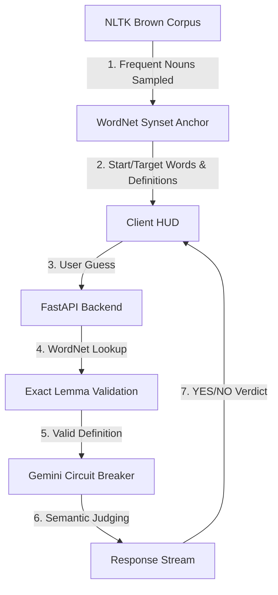

# Six Degrees: AI-Powered Semantic Navigation Engine

**Six Degrees** is a research-oriented word association engine that explores the boundaries of semantic reasoning and grounding in Large Language Models (LLMs). This project uses classical NLP (NLTK/WordNet) to anchor modern Generative AI into a strict, definition-first evaluation framework.

## 🧠 System Architecture



## ⚙️ Core Backend Logic: Semantic Grounding

The heart of Six Degrees is a robust backend designed to prevent "semantic drift"—a common issue where LLMs accept loose or slang-based associations that diverge from the intended dictionary sense.

### 1. Linguistic Grounding (NLTK & WordNet)
- **Noun Sampling**: The engine crawls the **NLTK Brown Corpus** to ensure the word pool is based on standard, high-frequency English usage.
- **Synset Enforcement**: Every word (Start, Target, and user Guess) is pinned to its **WordNet Synset**. The game logic forces the AI to consider *only* the specific dictionary definition of that synset, stripping away ambiguous secondary meanings.
- **Exact Lemma Mapping**: To prevent morphological glitches (e.g., WordNet morphing 'discuss' into 'discus'/disk), the engine performs strict lemma-name verification before definition retrieval.

### 2. The Literalist "Judge" & Prompt Engineering
The association judge is powered by Google Gemini, but restricted by a "literalist" system prompt. It evaluates connections based purely on the text of the definitions provided by WordNet, rejecting metaphorical or purely etymological links unless there is a physical or conceptual intersection in the formal definitions.

### 3. Circuit Breaker Architecture
To ensure extreme resiliency and high availability within free-tier API limits, the backend implements a tiered **Circuit Breaker** failover strategy:
1. `gemini-2.5-flash`: Primary high-reasoning model.
2. `gemini-2.1-flash`: Secondary stable backup.
3. `gemini-3.1-flash-lite-preview`: High-limit fallback (500 RPD).
4. `gemini-2.0-flash-lite`: Low-latency last resort.

If a model hits a **429 (Rate Limit)** or **Quota Exhaustion** error, the breaker instantly trips and locks the session onto the next available tier to prevent downtime.

## 🖥️ Client Implementation: Studio Obsidian
The client is a high-end "Minimalist Studio" frontend designed for zero latency and high-contrast transparency.
- **Obsidian Dark Mode**: Fixed at `#050505` with immersive ambient mesh gradients and noise texture overlays.
- **Evaluation Stream**: A vertical log using `JetBrains Mono` that treats game history as a live machine-evaluation stream.
- **Chromatic Aberration**: Visual glitch effects used as feedback for semantic failures (NO verdict).

## 🚀 Getting Started

### 📦 Backend Setup
1. `cd backend`
2. Create a `.env` file from `.env.example`:
   ```bash
   cp .env.example .env
   ```
3. Add your `GOOGLE_API_KEY` to the `.env` file. (Optional: Set `FRONTEND_URL` for CORS).
4. Install dependencies:
   ```bash
   pip install -r requirements.txt
   ```
5. Run the server:
   ```bash
   python main.py
   ```

### 🎨 Frontend Setup
1. `cd frontend`
2. Install dependencies:
   ```bash
   npm install
   ```
3. Run the development server:
   ```bash
   npm run dev
   ```

---
*Developed for research into LLM-based semantic association and dictionary-based grounding.*
