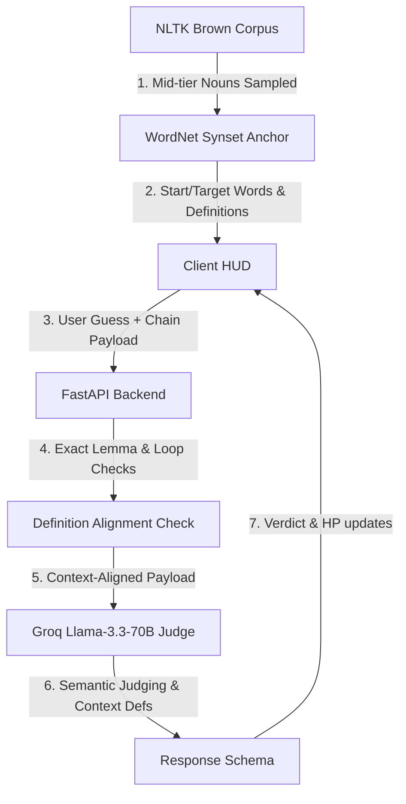

# Six Degrees: AI-Powered Semantic Navigation Engine

**Six Degrees** is a research-oriented word association engine that explores the boundaries of semantic reasoning and grounding in Large Language Models (LLMs). This project uses classical NLP (NLTK/WordNet) to anchor modern Generative AI into a strict, definition-first evaluation framework.

## 🧠 System Architecture


```mermaid
graph TD
    A[NLTK Brown Corpus] --"1. Mid-tier Nouns Sampled"--> B[WordNet Synset Anchor]
    B --"2. Start/Target Words & Definitions"--> C[Client HUD]
    C --"3. User Guess + Chain Payload"--> D[FastAPI Backend]
    D --"4. Exact Lemma & Loop Checks"--> E[Definition Alignment Check]
    E --"5. Context-Aligned Payload"--> F[Groq Llama-3.3-70B Judge]
    F --"6. Semantic Judging & Context Defs"--> G[Response Schema]
    G --"7. Verdict & HP updates"--> C
```

## ⚙️ Core Backend Logic: Semantic Grounding

The heart of Six Degrees is a robust backend designed to prevent "semantic drift"—a common issue where LLMs accept loose or slang-based associations that diverge from the intended dictionary sense.

### 1. Linguistic Grounding (NLTK & WordNet)
- **Noun Goldilocks Pool**: The engine crawls the **NLTK Brown Corpus**, extracting words from a high-quality mid-tier frequency range `[800:3500]`. This ensures the word pool is based on standard, high-frequency English nouns that are challenging yet intuitive.
- **Synset Non-Intersection**: Starting word pairs are filtered using hypernym validation to ensure they share zero immediate parent categories, maintaining a challenging starting baseline.

### 2. The Groq Semantic Arena Judge & Definition Alignment
The association judge is powered by **Groq's Llama-3.3-70B**, using strict JSON schema responses.
- **Perfect Definition Alignment**: To resolve polysemy drift (where a word changes identity mid-chain), the frontend passes the exact definitions displayed on screen directly inside the request. The judge evaluates connections strictly based on the text of these displayed definitions, preventing mismatched dictionary senses.
- **Loop Prevention**: Guesses are validated against the play history `chain` to instantly reject circular moves.
- **Context-Aware Updates**: When a jump is accepted, a dynamic contextual prompt updates the anchor definition based specifically on the semantic connection used to link the two words.

---

## 🖥️ Client Implementation: Studio Obsidian
The client is a high-end "Minimalist Studio" frontend designed for zero latency and high-contrast transparency.
- **Obsidian Dark Mode**: Fixed at `#0D0D0D` with immersive ambient mesh gradients and blur glow layers.
- **Evaluation Stream**: A vertical log using standard san-serif typography and `JetBrains Mono` that treats game history as a live semantic stream.
- **Strict Mount & Restart Stability**: Implemented an active `useRef` gate (`isStartingRef`) to completely block duplicate concurrent fetches triggered by React 18 `StrictMode` on load. decoupled guess validation states from resets to ensure that pressing restart does not trigger guess-loading states or auto-scrolling.
- **Glassmorphic Card Overlays**: When a restart is initiated, cards are overlaid with a gorgeous glassmorphic loading screen (`backdrop-blur-md` and `bg-black/60`) and a pulsing animated spinner ("Reshaping..."). Card entry transitions are disabled on mounts and restarts when `history.length === 0`, letting words snap in instantly.
- **Floating Animated Down-Arrow**: A circular bouncy capsule (`fixed bottom-28 left-1/2 -translate-x-1/2`) suspended over the input bar. It appears dynamically using Framer Motion only when the user scrolls up from the bottom of the feed by more than `150px` (with active history). Tapping it triggers a native smooth scroll back to the end of the chat.

---

## 🚀 Getting Started

### 📦 Backend Setup
1. `cd backend`
2. Create a `.env` file from `.env.example`:
   ```bash
   cp .env.example .env
   ```
3. Add your `GROQ_API_KEY` to the `.env` file:
   ```bash
   GROQ_API_KEY=your_groq_api_key_here
   ```
4. Install dependencies:
   ```bash
   pip install -r requirements.txt
   ```
5. Run the server:
   ```bash
   python main.py
   ```

### 🎨 Frontend Setup
1. `cd frontend`
2. Install dependencies:
   ```bash
   npm install
   ```
3. Run the development server:
   ```bash
   npm run dev
   ```

---
*Developed for research into LLM-based semantic association and dictionary-based grounding.*
