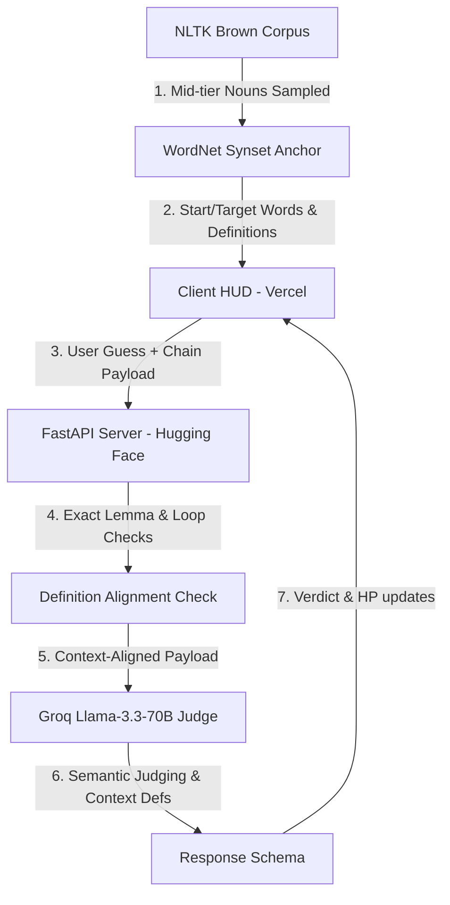

# Six Degrees: AI-Powered Semantic Navigation Engine

**Six Degrees** is a production-ready, full-stack semantic word-association platform that explores the boundaries of semantic reasoning and categorical grounding in Large Language Models (LLMs). The system anchors modern Generative AI into a strict, definition-first evaluation framework using classical NLP corpora and lexicographical trees.

**[🎮 Play the Live Production Demo →](https://six-degrees-six.vercel.app/)**

---

## 🎮 How It Works

Players are given a starting noun and a target noun generated dynamically by the backend. The objective is to bridge the two terms by chaining related words—each guess must connect directly to the active anchor definition on screen. 


```

START: MINE → diamond → ring → TARGET: LADY ✓

```
* **Accepted Move (-1 HP):** Strong semantic overlap with the anchor definition.
* **Elite Move (+1 HP):** Awarded for high creativity scores ($8+/10$) assigned by the judge.
* **Rejected Move (-2 HP):** Fails to connect or relies on weak mental shortcuts ("waffle-logic").

---

## 🧠 System Architecture

The platform is engineered using a decoupled, two-tier architecture distributed across edge infrastructure to maximize availability and isolation of heavy NLP dependencies.


```mermaid
graph TD
    A[NLTK Brown Corpus] --"1. Mid-tier Nouns Sampled"--> B[WordNet Synset Anchor]
    B --"2. Start/Target Words & Definitions"--> C[Client HUD - Vercel]
    C --"3. User Guess + Chain Payload"--> D[FastAPI Server - Hugging Face]
    D --"4. Exact Lemma & Loop Checks"--> E[Definition Alignment Check]
    E --"5. Context-Aligned Payload"--> F[Groq Llama-3.3-70B Judge]
    F --"6. Semantic Judging & Context Defs"--> G[Response Schema]
    G --"7. Verdict & HP updates"--> C

```

---

## ⚙️ Core Backend Logic: Semantic Grounding

The heart of *Six Degrees* is a robust validation pipeline designed to prevent **"semantic drift"**—a common failure mode where LLMs subconsciously accept loose, colloquial, or slang-based associations that diverge from the intended dictionary definition.

### 1. Linguistic Grounding (NLTK & WordNet)

* **Noun Goldilocks Pool**: The engine extracts words from a high-quality frequency range `[800:3500]` of the **NLTK Brown Corpus**. This skips trivial baseline vocabulary and highly obscure scientific jargon to maintain a challenging, intuitive word bank.
* **Synset Non-Intersection**: Starting word pairs are filtered using hierarchical validation to ensure they share zero immediate parent hypernyms, preventing mathematically trivial start/target alignments.
* **Local WordNet Validation Gates**: User inputs are screened against a local lexicographical database *before* hitting the network. If a word doesn't exist as a valid noun entry, the backend drops it immediately, preventing unnecessary cloud API compute billing overhead.

### 2. Context-Aware Judging via Groq (Llama 3.3 70B)

The association judge is powered by **Llama-3.3-70B-Versatile** on Groq's LPU infrastructure, running structural JSON execution mode.

* **Strict Definition Alignment**: To eliminate polysemy drift (e.g., a word switching its meaning mid-chain from an authority figure to a measuring instrument), the frontend passes the exact definition displayed to the user. The judge is bound to evaluate the connection strictly against that specific textual definition.
* **Multi-Turn Loop Prevention**: Guesses are verified against historical path arrays (`chain`) to instantly catch and reject circular gameplay.
* **Dynamic Contextual Updates**: When a move passes evaluation, a secondary contextual prompt updates the anchor definition based explicitly on the semantic connection used to bridge the last two nodes.

---

## 🖥️ Client Implementation: Studio Obsidian

The client is a fluid, minimalist "Studio" HUD designed for low latency, accessibility, and high-contrast glassmorphic visualization.

* **Obsidian Visual Frame**: Fixed theme at `#0D0D0D` with ambient backlighting mesh gradients, custom blur glow layers, and crisp typography utilizing `JetBrains Mono`.
* **Device-Agnostic Responsive Flow**: Built using a mobile-first Tailwind configuration. Layouts dynamically shift from rigid side-by-side structures on desktop viewports to single-column stacked panels on compact mobile displays, complete with auto-rotating vector indicators (`→` to `↓`).
* **Accessibility Standards**: All interactive layout modules, form submissions, and primary layout toggles are engineered to a minimum `44x44px` physical touch target boundary. Forms enforce a static base font scaling limit ($16\text{px}$) to suppress destructive viewport auto-zooming on mobile iOS devices.
* **Scrollable Chain Trail Capsule**: Implements an interactive path history widget (`overflow-x-auto no-scrollbar`) right under the core cards, allowing historical path trails to extend indefinitely without wrapping or breaking the HUD layout.
* **Strict Mount & Fetch Controls**: Uses an active React `useRef` gate (`isStartingRef`) to block duplicate concurrent API fetches triggered by React 18 `StrictMode` on component mounts.

---

## 🚀 Getting Started & Local Run

### 📦 1. Backend Server Setup

1. Navigate to the backend service folder:

```bash
   cd backend

```

2. Initialize environment variables from the template:

```bash
   cp .env.example .env

```

3. Insert your Groq API credentials into your active `.env` profile:

```bash
   GROQ_API_KEY=your_groq_api_key_here

```

4. Install python dependencies:

```bash
   pip install -r requirements.txt

```

5. Spin up the FastAPI app instance using Uvicorn:

```bash
   python main.py

```

### 🎨 2. Frontend Client Setup

1. Navigate to the frontend UI folder:

```bash
   cd frontend

```

2. Install client-side module dependencies:

```bash
   npm install

```

3. Boot up the Vite local development tracking server:

```bash
   npm run dev

```

---

## 🌐 Production Architecture & Deployment Details

* **Production Backend**: Containerized using a custom multi-stage **Docker** build and deployed on **Hugging Face Spaces** (2 vCPU, 16GB RAM instance). NLTK corpora are explicitly downloaded during the container build stage (`RUN python -c "import nltk..."`) to minimize boot latency and reduce runtime memory footprints.
* **Production Frontend**: Static asset packaging compiled via Vite (`npm run build`) and served globally across **Vercel's Edge CDN** with automated GitHub push deployments.

---

*Developed as a full-stack engineering research implementation into LLM-based semantic association and context-locked dictionary grounding.*
